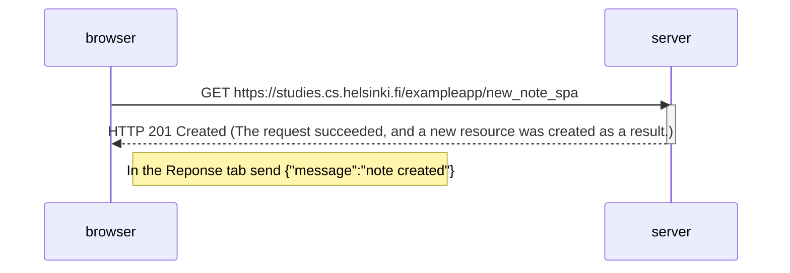

```mermaid

sequenceDiagram
    participant browser
    participant server

    browser->>server: GET https://studies.cs.helsinki.fi/exampleapp/new_note_spa
    activate server
    server-->>browser: HTTP 201 Created (The request succeeded, and a new resource was created as a result.)
    deactivate server


    Note right of browser: In the Reponse tab send {"message":"note created"}
```